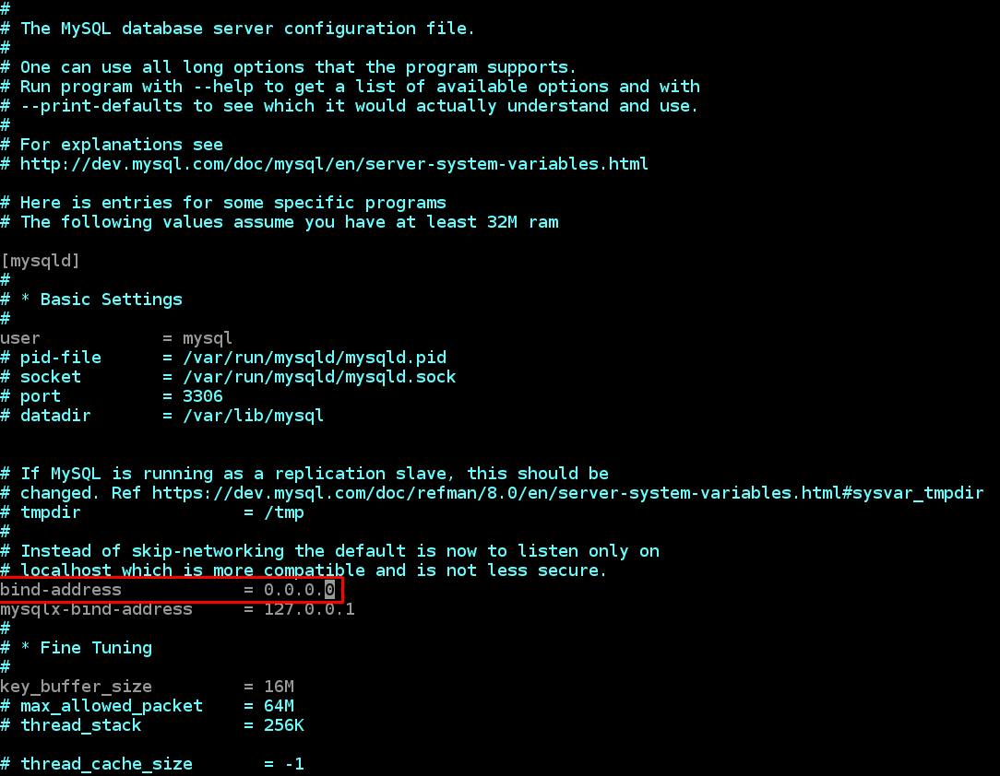

## **IMPLEMENT A CLIENT SERVER ARCHITECTURE USING MYSQL DATABASE MANAGEMENT SYSTEM (DBMS).**
#

### TASK – Implement a Client Server Architecture using MySQL Database Management System (DBMS).
To demonstrate a basic client-server using MySQL Relational Database Management System (RDBMS), follow the below instructions

1. Create and configure two Linux-based virtual servers (EC2 instances in AWS).
```
Server A name - `mysql server`
Server B name - `mysql client`
```
##
2. On `mysql server` Linux Server install MySQL **Server** software.
###
**Interesting fact:** MySQL is an open-source relational database management system. Its name is a combination of **"My"**, the name of co-founder Michael Widenius’s daughter, and **"SQL"**, the abbreviation for **Structured Query Language.**

From Step 2: Follow the steps in the link below to install mysql-server in the mysql-server ec2 instance.
P@ssw0rd

https://linuxhint.com/install-mysql-on-ubuntu-22-04/

Note: Before running the command sudo mysql_secure_installation, set the root password by running the command

 ALTER USER 'root'@'localhost' IDENTIFIED WITH mysql_native_password by 'my-secret-password';

After that run the command sudo mysql_secure_installation 

To the login to the mysql-server, run the command mysql -u root -p then enter the password P@ssw0rd

Create another user and a database, grant privileges of the database on the user and then flush the privileges as shown in the screenshot below:


###
3. On `mysql client` Linux Server install MySQL **Client** software.

From Step 3: follow the steps in the link below to install mysql-client on the mysql-client ec2 instance
https://techiescode.com/how-to-install-mysql-client-on-ubuntu-20-04-lts/

Run the command `mysql -V` to check if properlly installed

###
4. By default, both of your EC2 virtual servers are located in the same local virtual network, so they can communicate to each other using **local IP addresses**. Use `mysql server's` local IP address to connect from `mysql client`. MySQL server uses TCP port 3306 by default, so you will have to open it by creating a new entry in ‘Inbound rules’ in ‘mysql server’ Security Groups. For extra security, do not allow all IP addresses to reach your ‘mysql server’ – allow access only to the specific local IP address of your ‘mysql client’.
###
5. You might need to configure MySQL server to allow connections from remote hosts.

```sudo vi /etc/mysql/mysql.conf.d/mysqld.cnf```
###
Replace `‘127.0.0.1’` to `‘0.0.0.0’` like this:


###
6. From `mysql client` Linux Server connect remotely to `mysql server` Database Engine without using `SSH.` You must use the `mysql` utility to perform this action.

7. Check that you have successfully connected to a remote MySQL server and can perform SQL queries:

```
Show databases;
```

###
See screenshot for step 6 and 7 below:


###
If you see an output similar to the above image, then you have successfully completed this project – you have deloyed a fully functional MySQL Client-Server set up.
Well Done! You are getting there gradually. You can further play around with this set up and practice in creating/dropping databases & tables and inserting/selecting records to and from them.

Congratulations!


