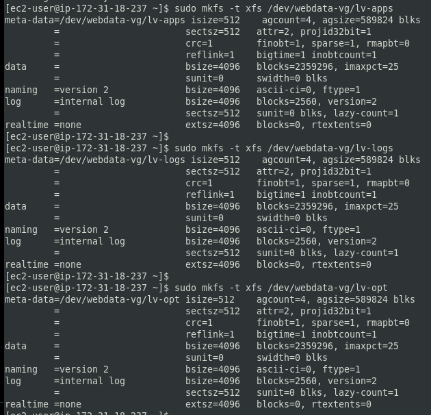

## STEP 1 – PREPARE NFS SERVER
### Step 1 – Prepare NFS Server

1. Spin up a new EC2 instance with RHEL Linux 8 Operating System.
    - Create three volumes and attach them to the NFS Instance. Make sure they are in thesame availability zone.
    
    - Connect to the NFS server (SSH)
    - Use `lsblk` to inspect what block devices are attached to the server
    - Use  `df -h` command to see all mounts and free space on your server
    - Use `gdisk` utility to create a single partition on each of the 3 disks. To know where path where the volumes `xvdf`, `xvdg` and `xvdh` are created, run `sudo ls /dev` and you will find the three volumes listed there. Note that the `dev` here means `device`

    ```
    sudo gdisk /dev/xvdf
    ```

```
[ec2-user@ip-172-31-81-21 ~]$ sudo gdisk /dev/xvdf
GPT fdisk (gdisk) version 1.0.7

Partition table scan:
  MBR: not present
  BSD: not present
  APM: not present
  GPT: not present

Creating new GPT entries in memory.

Command (? for help): n
Partition number (1-128, default 1): 1       // We entered 1 because we want to use the whole disk
First sector (34-20971486, default = 2048) or {+-}size{KMGTP}:  //Press ENter
Last sector (2048-20971486, default = 20971486) or {+-}size{KMGTP}: // Press Enter
Current type is 8300 (Linux filesystem)
Hex code or GUID (L to show codes, Enter = 8300): 8e00  // Enter L to list codes. And here we enter 8e00
Changed type of partition to 'Linux LVM'

Command (? for help): p // Use the command P to check what has been done, which shows things are right as seen below
Disk /dev/xvdf: 20971520 sectors, 10.0 GiB
Sector size (logical/physical): 512/512 bytes
Disk identifier (GUID): 78B9C180-21BD-4709-A2D2-424D18B6259F
Partition table holds up to 128 entries
Main partition table begins at sector 2 and ends at sector 33
First usable sector is 34, last usable sector is 20971486
Partitions will be aligned on 2048-sector boundaries
Total free space is 2014 sectors (1007.0 KiB)

Number  Start (sector)    End (sector)  Size       Code  Name
   1            2048        20971486   10.0 GiB    8E00  Linux LVM

Command (? for help): 

Command (? for help): w // Enter w to write and continue with a yes as prompted

Final checks complete. About to write GPT data. THIS WILL OVERWRITE EXISTING
PARTITIONS!!

Do you want to proceed? (Y/N): y  //Enter y for yes
OK; writing new GUID partition table (GPT) to /dev/xvdf.
The operation has completed successfully.

```

**Note:** Now,  your changes has been configured succesfuly, exit out of the `gdisk` console `and do the same for the remaining disks`.

   - Use `lsblk` utility to view the newly configured partition on each of the 3 disks.

2. Based on your LVM experience from [Project 6](https://dareyio-pbl-progressive.readthedocs-hosted.com/en/latest/project6.html), Configure LVM on the Server.

    - Install `lvm2` package using `sudo yum install lvm2 -y`
    - Confirm that `lvm` is properly installed and on your system by running the command `which lvm`
    - Run `sudo lvmdiskscan` to check the available partition
    - Run `lsblk` utility to view the newly configured partition on each of the 3 disks

    

    **Note:** Previously, in Ubuntu we used `apt` command to install packages, in RedHat/CentOS a different package manager is used, so we shall use `yum` command instead.

    **Mark each of of the 3 disks as physical volumes(PVs)**
    
    - Use `pvcreate` utility to mark each of 3 disks as physical volumes (PVs) to be used by LVM.

    ```
    sudo pvcreate /dev/xvdf1
    sudo pvcreate /dev/xvdg1
    sudo pvcreate /dev/xvdh1
    ```

    **Note:** you cannot create physical volumes directly on your physical device. You have to create them on a partition

    - Run `sudo pvs` to verify that your Physical volume has been created successfully 

      

    - Use [vgcreate](https://linux.die.net/man/8/vgcreate) utility to add all 3 PVs to a volume group (VG). Name the VG **webdata-vg**. You can use `vgextend` to also dynamically extend the Logical volume group, which increases the capacity of the volume group by adding physical volumes when the need arises

    ```
    sudo vgcreate webdata-vg /dev/xvdh1 /dev/xvdg1 /dev/xvdf1
    ```
    **Note:** the above command is used to group the 3 physical volumes together into a volume group(VG) which we named as **webdata-vg**

    - Verify that your VG has been created successfully by running `sudo vgs`. And also see how the physical volumes has been grouped together running `sudo pvs` again and added the capacities of each of the physical volumes together as shown in the first image below. Also note that due to the grouping/concatenation of the 3 disks, they are now `1 logical` disk

      

    - Use [lvcreate](https://linux.die.net/man/8/lvcreate) utility to create 3 logical volumes. **lv-apps(Use 9GB)**, **lv-logs(Use 9GB)** and **lv-opt(Use 9GB)**

    **Note:**
    Ensure there are 3 Logical Volumes. `lv-opt` `lv-apps`, and `lv-logs`

    **NOTE:** `lv-apps` will be used to `store data for the Website` while, `lv-logs` will be used to `store data for logs`.


    ```
    sudo lvcreate -n lv-apps -L 9G webdata-vg
    sudo lvcreate -n lv-logs -L 9G webdata-vg
    sudo lvcreate -n lv-opt -L 9G webdata-vg

    sudo lvs
    ```

       

    **NOTE:** that the logical volume is what we give to our servers. You dont give physical volumes to servers, rather it is logical volumes

    **Scenerio:** assuming the apps or logs logical volumes is filled up. We can extend them if volume group still has space. But in a case where the volume group also, do not have more space, we can add more physical volume(s). Use the `gdisk` utility to create single partitions on the disk, Mark the physical volume using `pvcreate`, use the `vgextend` command to dynamically extend the LVM volume group, use the `lvextend` to extend the size of say each of the logical volume(s). So we can increase/decrease the size of our disk without switching of the server, which is the essence of logical disk management

    - Verify the entire setup

    ```
    sudo vgdisplay -v #view complete setup - VG, PV, and LV

    sudo lsblk
    ```

       
   
       

    - Instead of formatting the disks as `ext4` you will have to format them as [xfs](https://en.wikipedia.org/wiki/XFS)

    ```
    sudo mkfs -t xfs /dev/webdata-vg/lv-apps
    sudo mkfs -t xfs /dev/webdata-vg/lv-logs
    sudo mkfs -t xfs /dev/webdata-vg/lv-opt

    ```
      


3. Create mount points on `/mnt` directory for the logical volumes as follow:
    Mount `lv-apps` on `/mnt/apps` – To be used by webservers
    Mount `lv-logs` on `/mnt/logs` – To be used by webserver logs
    Mount `lv-opt` on `/mnt/opt` – To be used by Jenkins server in [Project 8](https://dareyio-pbl-progressive.readthedocs-hosted.com/en/latest/project8.html)

    - Create the directories
    ```
    sudo mkdir /mnt/apps
    sudo mkdir /mnt/logs
    sudo mkdir /mnt/opt

    ```
    - Mount the logical volumes on the `/mnt/apps`, `/mnt/logs`, `/mnt/opt` directories respectively

    ```
    sudo mount /dev/webdata-vg/lv-apps /mnt/apps
    sudo mount /dev/webdata-vg/lv-logs /mnt/logs
    sudo mount /dev/webdata-vg/lv-opt /mnt/opt

    ```

4. Install `NFS server`, configure it to start on reboot and make sure it is up and running

```
    sudo yum -y update
    sudo yum install nfs-utils -y
    sudo systemctl start nfs-server.service
    sudo systemctl enable nfs-server.service
    sudo systemctl status nfs-server.service
```

5. Export the mounts for webservers’ `subnet cidr` to connect as clients. For simplicity, you will install your all three Web Servers inside the same subnet, but in production set up you would probably want to separate each tier inside its own subnet for higher level of security.

To check your `subnet cidr` – open your EC2 details in AWS web console and locate ‘Networking’ tab and open a Subnet link:


Make sure we set up permission that will allow our Web servers to read, write and execute files on NFS:

```
    sudo chown -R nobody: /mnt/apps
    sudo chown -R nobody: /mnt/logs
    sudo chown -R nobody: /mnt/opt

    sudo chmod -R 777 /mnt/apps
    sudo chmod -R 777 /mnt/logs
    sudo chmod -R 777 /mnt/opt

    sudo systemctl restart nfs-server.service

```

Configure access to NFS for clients within the same subnet (example of Subnet CIDR – 172.31.32.0/20 ):

```
    sudo vi /etc/exports

    /mnt/apps <Subnet-CIDR>(rw,sync,no_all_squash,no_root_squash)
    /mnt/logs <Subnet-CIDR>(rw,sync,no_all_squash,no_root_squash)
    /mnt/opt <Subnet-CIDR>(rw,sync,no_all_squash,no_root_squash)

    Esc + :wq!

    sudo exportfs -arv

```

6. Check which port is used by NFS and open it using Security Groups (add new Inbound Rule)

    ```
    rpcinfo -p | grep nfs
    
    ```


**Important note:** In order for NFS server to be accessible from your client, you must also open following ports: TCP 111, UDP 111, UDP 2049


Click on the security groups for the nfs and open the ports as shown above(ie. its same)


