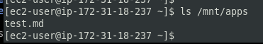

## STEP 2 — CONFIGURE THE DATABASE SERVER
By now you should know how to install and configure a MySQL DBMS to work with remote Web Server

1. Install MySQL server
    ```
    sudo apt update -y
    sudo apt install mysql-server
    ```
2. Create a database and name it `tooling`
    ```
    sudo mysql
    create database tooling;

    ```
3. Create a database user and name it `webaccess`
    **NOTE:** Grab the common `subnet CIDR` address for the 3 webservers that will be accessing the database
    ```
    create user 'webaccess'@'172.31.16.0/20' identified by 'password';
    ```
    
4. Grant permission to `webaccess` user on `tooling` database to do anything only from the webservers `subnet cidr`
    ```
    grant all privileges on tooling.* to 'webaccess'@'172.31.16.0/20';
    flush privileges;
    ```
    

## Step 3 — Prepare the Web Servers
We need to make sure that our Web Servers can serve the same content from shared storage solutions, in our case – NFS Server and MySQL database.

You already know that one DB can be accessed for `reads` and `writes` by multiple clients. For storing shared files that our Web Servers will use – we will utilize NFS and mount previously created Logical Volume `lv-apps` to the folder where Apache stores files to be served to the users (`/var/www`).

This approach will make our Web Servers `stateless`, which means we will be able to add new ones or remove them whenever we need, and the integrity of the data (in the database and on NFS) will be preserved.

During the next steps we will do following:

   - Configure NFS client (this step must be done on all three servers)
   - Deploy a Tooling application to our Web Servers into a shared NFS folder
   - Configure the Web Servers to work with a single MySQL database


1. Launch a new EC2 instance with RHEL 8 Operating System (ie if you have not included this when creating the `NFS` and `DB` servers)

2. Install NFS client

    ```
        sudo yum update -y
        sudo yum install nfs-utils nfs4-acl-tools -y
    ```

3. Mount `/var/www/` and target the NFS server’s export for apps

    ```
        sudo mkdir /var/www
        sudo mount -t nfs -o rw,nosuid <NFS-Server-Private-IP-Address>:/mnt/apps /var/www
        df -h
    ```
   

**NOTE:** If everything goes well, when you create a file on the path `/var/www` in the webserver, you should be able to access or see it in the logical volume in the nfs server(ie in this case `172.31.18.237:/mnt/apps`) as shown below:

   

   

4. Verify that NFS was mounted successfully by running `df -h`. Make sure that the changes will persist on Web Server after reboot:

    ```
        sudo vi /etc/fstab
    ```
add following line

    ```
        <NFS-Server-Private-IP-Address>:/mnt/apps /var/www nfs defaults 0 0
    ```
5. Install [Remi’s repository](http://www.servermom.org/how-to-enable-remi-repo-on-centos-7-6-and-5/2790/), Apache and PHP

```
    sudo yum install httpd -y

    sudo dnf install https://dl.fedoraproject.org/pub/epel/epel-release-latest-9.noarch.rpm -y

    sudo dnf install dnf-utils http://rpms.remirepo.net/enterprise/remi-release-9.rpm -y

    sudo dnf module reset php -y

    sudo dnf module enable php:remi-7.4 -y

    sudo dnf install php php-opcache php-gd php-curl php-mysqlnd -y

    sudo systemctl start php-fpm

    sudo systemctl enable php-fpm

    sudo setsebool -P httpd_execmem 1

```

Also do `Step 9 - Note 2` below on each of those webservers

**Repeat steps 1-5 for another 2 Web Servers.**

6. Verify that Apache files and directories are available on the Web Server in `/var/www` and also on the NFS server in `/mnt/apps`. If you see the same files – it means NFS is mounted correctly. You can try to create a new file `touch test.txt` from one server and check if the same file is accessible from other Web Servers.

7. Locate the `log` folder for Apache on the `WebServer` and mount it to `NFS server’s` export for `logs`.

    ```
        sudo mount -t nfs -o rw,nosuid <NFS-Server-Private-IP-Address>:/mnt/logs /var/log/httpd
    ```

Repeat step `No 4` to make sure the mount point will persist after reboot.
Step 4:

    ```
        sudo vi /etc/fstab
    ```
add following line

    ```
        <NFS-Server-Private-IP-Address>:/mnt/logs /var/log/httpd nfs defaults 0 0
    ```
8. Fork the tooling source code from [Darey.io Github Account](https://github.com/darey-io/tooling.git) to your Github account. (Learn how to fork a repo [here](https://youtu.be/f5grYMXbAV0))

If git has not been installed on the webserver. install by running:

   ```
    sudo yum install git
    git init 
    git clone https://github.com/justmic007/tooling.git
    cd tooling
   ```

9. Deploy the tooling website’s code to the Webserver. Ensure that the html folder from the repository is deployed to `/var/www/html`

   ```
    ls /var/www
    ls /var/www/html
    ls
    sudo cp -R html/. /var/www/html
    ls /var/www/html
    ls html 

   ```
Check that the apache service is running: ``` sudo systemctl status httpd ```
**Note 1:** Do not forget to open TCP port 80 on the Web Server.

**

**Note 2:** If you encounter 403 Error – check permissions to your `/var/www/html` folder and also disable SELinux 
   ```
    sudo setenforce 0
   ```

To make this change permanent – open following config file 
   ```
    sudo vi /etc/sysconfig/selinux
   ``` 
   and set 
   ```
      SELINUX=disabled
   ```
   then `restart httpd` by running and ensuring that the Apache HTTP Server and turned `active (running)`
   ```
     sudo systemctl status httpd
     sudo systemctl start httpd
   ```
   

   


 10. Update the website’s configuration to connect to the database (in `/var/www/html/functions.php` file). 

    - Update the db connection string with the database `private-ip-address`, `username` and `password`

 Apply `tooling-db.sql` script to your database using this command `mysql -h <databse-private-ip> -u <db-username> -p <db-password> < tooling-db.sql`
    - First install mysql client ``` sudo yum install mysql ```
    - ``` cd tooling ``` i.e where the mysql script is
    - Still on the webserver, Run ```mysql -h 172.31.19.64 -u webaccess -p tooling < tooling-db.sql```. This should not return any error. If any error, troubleshoot using Note 1 to Note 3 below:

   

**Note 1:** Open the `MYSQL/Aurora` Port in the `DB Server` and allow access from the `CIDR address of the webservers`

**Note 2:** Ensure the mysql service is running in the DB Server by running `sudo systemctl status/start mysql` as the case maybe

**Note 3:**Update the bind address in the DB Server by running `sudo vi /etc/mysql/mysql.conf.d/mysqld.cnf` and updating the `bind-address` and `mysqlx-bind-address` to `0.0.0.0`,  allowing connections from anywhere. Then restart mysql in the DB Server `sudo systemctl restart mysql` and `sudo systemctl status mysql`

   


After successfully dumping data in the database. Head to the DB Server and run the commands in the screenshot below:

   .png)


11. Create in MySQL a new `admin` user with username: `myuser` and password: `password` and apply the tooling script again(eg `mysql -h 172.31.19.164 -u webaccess -p tooling < tooling-db.sql`):

```
INSERT INTO ‘users’ (‘id’, ‘username’, ‘password’, ’email’, ‘user_type’, ‘status’) VALUES
-> (1, ‘micah’, ‘5f4dcc3b5aa765d61d8327deb882cf99’, ‘micahoghale@gmail.com, ‘admin’, ‘1’);
```

   

   

12. Open the website in your browser `http://<Web-Server-Public-IP-Address-or-Public-DNS-Name>/login.php` and make sure you can login into the website with `myuser` user.


Congratulations!
You have just implemented a web solution for a DevOps team using LAMP stack with remote Database and NFS servers.

