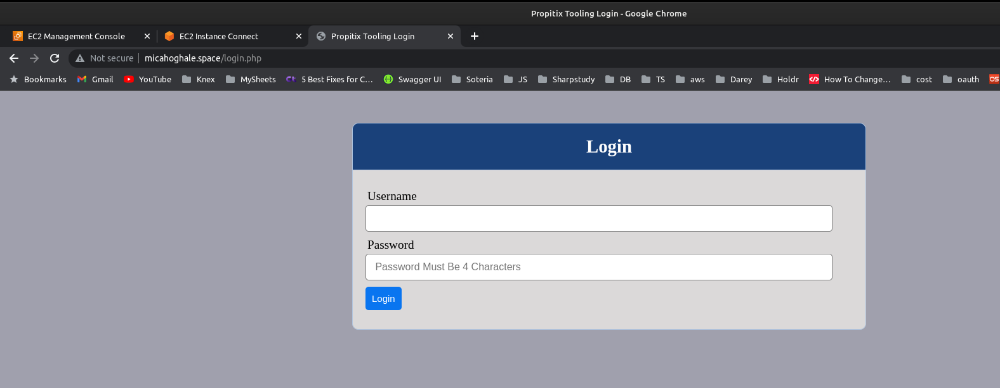

## CONFIGURE NGINX AS A LOAD BALANCER

You can either uninstall Apache from the existing Load Balancer server, or create a fresh installation of Linux for Nginx.

1. Create an EC2 VM based on Ubuntu Server 20.04 LTS and name it `Nginx LB`(do not forget to open TCP port 80 for HTTP connections, also open TCP port **443** – this port is used for secured HTTPS connections)

2. Update `/etc/hosts` file for local DNS with Web Servers’ names (e.g. `Web1` and `Web2`) and their local IP addresses

3. Install and configure Nginx as a load balancer to point traffic to the resolvable DNS names of the webservers

Update the instance and Install Nginx

```
sudo apt update
sudo apt install nginx
sudo systemctl enable nginx && sudo systemctl start nginx
```
Configure Nginx LB using Web Servers’ names defined in `/etc/hosts`

**Hint:** Read this [blog](https://linuxize.com/post/how-to-edit-your-hosts-file/) to read about `/etc/host`

Open the default nginx configuration file
```
sudo vi /etc/nginx/nginx.conf
```

```
#insert following configuration into http section

 upstream web {
    server WEBSERVER1 weight=5;
    server WEBSERVER2 weight=5;
    server WEBSERVER3 weight=5;
  }

server {
    listen 80;
    server_name micahoghale.space www.micahoghale.space;
    location / {
      proxy_set_header X-Forwarded-For $proxy_add_x_forwarded_for;
      proxy_pass http://web;
    }
  }

#comment out this line
#       include /etc/nginx/sites-enabled/*;
```

Restart Nginx and make sure the service is up and running

```
sudo systemctl restart nginx
sudo systemctl status nginx
```


**Side Self Study:** Read more about HTTP load balancing methods and features supported by Nginx [on this page](https://docs.nginx.com/nginx/admin-guide/load-balancer/http-load-balancer/)