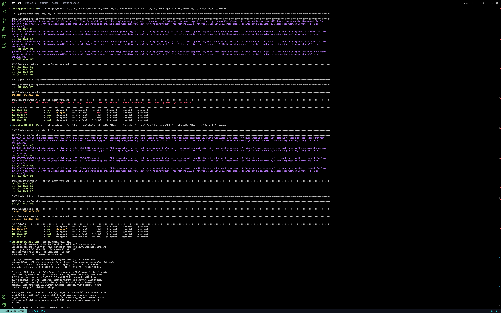

# RUN FIRST ANSIBLE TEST


Note: We `installed Remote Development` pack extension by microsoft on VScode. The Icon is located on the left bottommost part of the vscode view

Click on the Icon
Select `Connect to Host` to connect to the `Jenkins-Ansible` server
Enter `ssh -A ubuntu@18.216.144.182`

Note: if you get permission error like this: `Could not establish connection to "18.216.144.182": Permission denied (publickey).`, click `More Actions`, then click on `Open SSH Configuration File`, Click on `/Users/micah/.ssh/config` and Enter the below config snippet and save.

```
Host Jenkins-Ansible
  HostName 18.216.144.182
  User ubuntu
  IdentityFile /Users/micah/Documents/workspace/darey.io/devops/pbl7-key-pair.pem
  ForwardAgent yes
  ControlPath /tmp/ansible-ssh-%h-%p-%r
  ControlMaster auto
  ControlPersist 10m
```
Close
Click on the Remote Development extension again. By now, you should see the Host you saved in the config file and select it
If you see an error like this: `Could not establish connection to "Jenkins-Ansible".`, click on More Actions
Click on `Disconnected from SSH`,
Click on `Connect Current Window to Host`
Select the `Host` name eg `Jenkins-Ansible` that was used in as `Host` in the config snippet above

## Step 7 – Run first Ansible test
Now, it is time to execute `ansible-playbook` command and verify if your playbook actually works:
```
    cd ansible-config-mgt

    ansible-playbook -i inventory/dev.yml playbooks/common.yml
```

ansible-playbook -i /var/lib/jenkins/jobs/ansible/builds/13/archive/inventory/dev.yaml /var/lib/jenkins/jobs/ansible/builds/13/archive/playbooks/common.yml

You can go to each of the servers and check if `wireshark` has been installed by running `which wireshark` or `wireshark --version`


Your updated with Ansible architecture now looks like this:


Output on vscode remote connection



### Optional step – Repeat once again
Update your ansible playbook with some new Ansible tasks and go through the full `checkout -> change codes -> commit -> PR -> merge -> build -> ansible-playbook` cycle again to see how easily you can manage a servers fleet of any size with just one command!

### Congratulations
You have just automated your routine tasks by implementing your first Ansible project! There is more exciting projects ahead, so lets keep it moving!