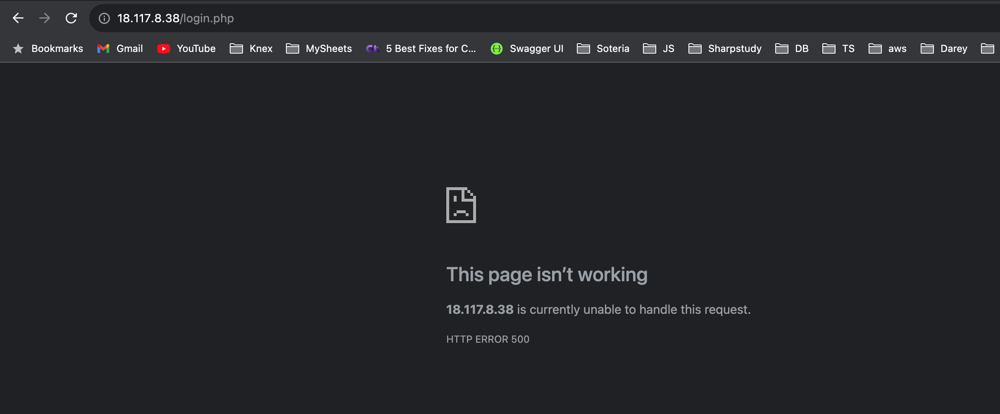

# LOAD BALANCER ROLES

## Load Balancer roles

We want to be able to choose which Load Balancer to use, `Nginx` or `Apache`, so we need to have `two roles` respectively:

  1. Nginx
  2. Apache

With your experience on Ansible so far you can:

   - Decide if you want to develop your own roles, or find available ones from the community
     - Note: You can download `apache` and `nginx` roles same way as you downloaded/installed the roles from `ansible galaxy`
       - `ansible-galaxy install geerlingguy.nginx` and `ansible-galaxy install geerlingguy.apache`. Then rename both to `nginx` and `apache` respectively
   - Update both `static-assignment` and `site.yml` files to refer the roles

***Important Hints:***

   - Since you cannot use both ***Nginx*** and ***Apache*** load balancer, you need to add a condition to enable either one – this is where you can make use of variables.
   - Read the README.md files for both `apache` and `nginx` roles respectively and Declare a variable in `defaults/main.yml` file inside the `Nginx` and `Apache` roles. Name each variables `enable_nginx_lb` and `enable_apache_lb` respectively.

In the `defaults/main.yml`, uncomment the code blocks as seen below with populated private ips of the uat-webservers 

  ```
  nginx_upstreams:
  - name: myapp1
    strategy: "ip_hash" # "least_conn", etc.
    keepalive: 16 # optional
    servers:
      # - "srv1.example.com"
      # - "srv2.example.com weight=3"
      # - "srv3.example.com"
      - "172.31.25.214 weight=3" # Private IPs of the uat servers
      - "172.31.19.54 weight=3" # Private IPs of the uat servers

  

  nginx_extra_http_options: 
  # Example extra http options, printed inside the main server http config:
    nginx_extra_http_options: |
      proxy_buffering    off;
      proxy_set_header   X-Real-IP $remote_addr;
      proxy_set_header   X-Scheme $scheme;
      proxy_set_header   X-Forwarded-For $proxy_add_x_forwarded_for;
      proxy_set_header   Host $http_host;

  ```

  Goto `roles/nginx/tasks` and add `become: true` priviledge as shown below:

  ```
  # Nginx setup.
  - name: Copy nginx configuration in place.
    become: true
    template:
      src: "{{ nginx_conf_template }}"
      dest: "{{ nginx_conf_file_path }}"
      owner: root
      group: "{{ root_group }}"
      mode: 0644
    notify:
      - reload nginx

  - name: Ensure nginx service is running as configured.
    become: true
    service:
      name: nginx
      state: "{{ nginx_service_state }}"
      enabled: "{{ nginx_service_enabled }}"


  # Setup/install tasks.
  - include_tasks: setup-RedHat.yml
    when: ansible_os_family == 'RedHat' # or ansible_os_family == 'Rocky' or ansible_os_family == 'AlmaLinux'
  ```


  
   - Set both values to false like this `enable_nginx_lb: false` and `enable_apache_lb: false`.
   - Declare another variable in both roles `load_balancer_is_required` and set its value to `false` as well

Update both assignment and `site.yml` files respectively

`loadbalancers.yml` file
```
- hosts: lb
  roles:
    - { role: nginx, when: enable_nginx_lb and load_balancer_is_required }
    - { role: apache, when: enable_apache_lb and load_balancer_is_required }

```

`site.yml` file
```
  - name: Loadbalancers assignment
    hosts: lb
      - import_playbook: ../static-assignments/loadbalancers.yml
      when: load_balancer_is_required

```

Now you can make use of `env-vars\uat.yml` file to define which loadbalancer to use in UAT environment by setting respective environmental variable to `true`.

You will activate load balancer, and enable `nginx` by setting these in the respective environment’s `env-vars` file.
```
enable_nginx_lb: true
load_balancer_is_required: true

```
The same must work with `apache` LB, so you can switch it by setting respective environmental variable to `true` and other to `false`.

To test this, you can update inventory for each environment and run Ansible against each environment.

#

## SPECIAL NOTE:

In my case, the above did not work, even after using the Project 13 video guide. So i did some debugging and came up with the below:

Goto the `webserver` folder under `roles` - `webservers` - `tasks` - `main.yml` file and comment out the whole task for apache and pase the below block of code(ansible tasks)

```
      ---
      - name: Update system packages using yum
        ansible.builtin.yum:
          name: '*'
          state: latest

      - name: Install and configure Nginx
        become: true
        ansible.builtin.yum:
          name: "nginx"
          state: present

      - name: Install git
        become: true
        ansible.builtin.yum:
          name: "git"
          state: present

      - name: Install PHP and required extensions
        become: true
        ansible.builtin.yum:
          name: "{{ item }}"
          state: present
        loop:
          - php
          - php-fpm
          - php-common
          - php-curl
          - php-json
          - php-pdo
          - php-mbstring
          - php-xml
          - php-mysqli

      - name: Enable PHP MySQLi Extension
        replace:
          path: /etc/php.ini
          regexp: '^;extension=mysqli$'
          replace: 'extension=mysqli'
        notify: Restart PHP-FPM

      - name: Check PHP Configuration
        command: php -i | grep php.ini
        register: php_config

      - name: Display PHP Configuration
        debug:
          var: php_config.stdout_lines

      - name: Start PHP-FPM service
        ansible.builtin.systemd:
          name: php-fpm
          state: started

      - name: Add Git exception for directory with dubious ownership
        become: true
        ansible.builtin.command: git config --global --add safe.directory /usr/share/nginx/html

      - name: Create a temporary directory within /usr/share/nginx/
        ansible.builtin.file:
          path: /usr/share/nginx/temporary
          state: directory
        register: temp_dir

      - name: Clone a repo using the git module
        become: true
        ansible.builtin.git:
          repo: https://github.com/justmic007/tooling.git
          dest: "{{ temp_dir.path }}"
          version: master  # You can specify a specific branch or commit if needed
          force: yes

      - name: Use rsync to move contents to /usr/share/nginx/html
        ansible.builtin.shell: rsync -a --delete "{{ temp_dir.path }}/" /usr/share/nginx/html/
        ansible.builtin.shell: rsync -a --delete --exclude=index.html --exclude=50x.html "{{ temp_dir.path }}/" /usr/share/nginx/html/

      - name: Copy html content to one level up
        become: true
        ansible.builtin.copy:
          src: /usr/share/nginx/html/html/
          dest: /usr/share/nginx/html/
          remote_src: yes

      - name: Set ownership and permissions for /usr/share/nginx/html
        # become: true
        ansible.builtin.file:
          path: /usr/share/nginx/html
          owner: nginx  # Change this to the appropriate user
          group: nginx  # Change this to the appropriate group
          mode: '0755'  # Sets permissions to rwxr-xr-x
          recurse: yes
          # force: yes

      - name: Set ownership and permissions for /var/run/php-fpm/www.sock
        # become: true
        ansible.builtin.file:
          path: /var/run/php-fpm
          # path: /var/run/php-fpm/www.sock
          owner: nginx  # Change this to the appropriate user
          group: nginx  # Change this to the appropriate group
          mode: '0755'  # Sets permissions to rwxr-xr-x
          recurse: yes
          # force: yes

      - name: Set ownership and permissions for /var/log/nginx/
        ansible.builtin.file:
          path: /var/log/nginx
          owner: nginx
          group: nginx
          mode: '0755'
          recurse: yes

      - name: Set ownership and permissions for /var/log/php-fpm/
        ansible.builtin.file:
          path: /var/log/php-fpm
          owner: nginx
          group: nginx
          mode: '0755'
          recurse: yes
        # register: file_result
      - name: Set ownership and permissions for /etc/nginx/
        ansible.builtin.file:
          path: /etc/nginx
          owner: nginx
          group: nginx
          mode: '0755'
          recurse: yes
        # register: file_result

      - name: Set ownership and permissions for /etc/php-fpm.d
        ansible.builtin.file:
          path: /etc/php-fpm.d
          owner: nginx
          group: nginx
          mode: '0755'
          recurse: yes
        # register: file_result

      - name: Set ownership and permissions for /var/run/php-fpm
        ansible.builtin.file:
          path: /var/run/php-fpm
          owner: nginx
          group: nginx
          mode: '0755'
          recurse: yes
        # register: file_result

      - name: Set ownership and permissions for /var/lib/php
        ansible.builtin.file:
          path: /var/lib/php
          owner: nginx
          group: nginx
          mode: '0755'
          recurse: yes
        # register: file_result

      - name: Replace user and group settings in www.conf
        replace:
          path: /etc/php-fpm.d/www.conf
          regexp: '^(user|group) = .*'
          replace: '\1 = nginx'  # Update to the desired user (e.g., nginx)

      - name: Replace the code block
        become: yes
        ansible.builtin.replace:
          path: /etc/nginx/conf.d/default.conf
          regexp: '#location ~ \\.php\$ {\n    #    root           html;\n    #    fastcgi_pass   127.0.0.1:9000;\n    #    fastcgi_index  index.php;\n    #    fastcgi_param  SCRIPT_FILENAME  /scripts\$fastcgi_script_name;\n    #    include        fastcgi_params;\n    #}'
          replace: |
            location ~ \.php$ {
                root           /usr/share/nginx/html;
                fastcgi_pass   unix:/var/run/php-fpm/www.sock;
                fastcgi_index  index.php;
                fastcgi_param  SCRIPT_FILENAME  $document_root$fastcgi_script_name;
                include        fastcgi_params;
            }

      - name: Replace root and index in location block
        become: yes
        ansible.builtin.replace:
          path: /etc/nginx/conf.d/default.conf
          regexp: 'location / {[^\}]*}'
          replace: |
            location / {
                root   /usr/share/nginx/html;
                index  index.php index.html index.htm;
            }

      - name: Start service nginx, if not started
        become: true
        ansible.builtin.service:
          name: nginx
          state: started

      - name: Recursively remove /usr/share/nginx/html/html/ directory
        become: true
        ansible.builtin.file:
          path: /usr/share/nginx/html/html
          state: absent

```


Goto `webservers` - `templates` - `nginx.conf.js2` and paste the below. Dont forget to replace the server IP address with your `uat` server IPs

```
        user nginx;

        error_log  /var/log/nginx/error.log warn;
        pid        /var/run/nginx.pid;

        
        worker_processes  1;
        

        
            env VARIABLE;
            include /etc/nginx/main.d/*.conf;
        

        
        events {
            worker_connections  1024;
            multi_accept off;
        }
        

        http {
            

        
            include       /etc/nginx/mime.types;
            default_type  application/octet-stream;

            server_names_hash_bucket_size 64;

            client_max_body_size 64m;

            log_format  main  '$remote_addr - $remote_user [$time_local] "$request" '
          '$status $body_bytes_sent "$http_referer" '
          '"$http_user_agent" "$http_x_forwarded_for"';

            access_log  /var/log/nginx/access.log main buffer=16k;

            sendfile        on;
            tcp_nopush      on;
            tcp_nodelay     on;

            keepalive_timeout  65;
            keepalive_requests 100;

            server_tokens on;
        
            proxy_cache_path /var/cache/nginx keys_zone=cache:32m;
        
        

        
            # gzip on;
        

        
            proxy_buffering    off;
              proxy_set_header   X-Real-IP $remote_addr;
              proxy_set_header   X-Scheme $scheme;
              proxy_set_header   X-Forwarded-For $proxy_add_x_forwarded_for;
              proxy_set_header   Host $http_host;

        

        
        
            upstream myapp1 {
        
                {{ upstream.strategy }};
        
        
                server 172.31.12.118;
                server 172.31.15.59;
        
        
                keepalive 16;
        
            }
        
        

        
            include /etc/nginx/conf.d/*.conf;
        
            include /etc/nginx/conf.d/*;
        
        

            
        }

```


Goto `nginx` - `tasks` - `main.yml` and paste the block of codes. Remember to replace the IPs with uat servers private IPs

```
      ---

      # Variable setup.
      - name: Include OS-specific variables.
        include_vars: "{{ ansible_os_family }}.yml"

      - name: Define nginx_user.
        set_fact:
          # nginx_user: "nginx"
          nginx_user: "{{ __nginx_user }}"
        when: nginx_user is not defined


      # Setup/install tasks.
      - include_tasks: setup-RedHat.yml
        when: ansible_os_family == 'RedHat' # or ansible_os_family == 'Rocky' or ansible_os_family == 'AlmaLinux'

      # I used the Debug mode to check the os family and why other `include_tasks` where skipping
      - name: Debug ansible_os_family
        debug:
          var: ansible_os_family

      - name: Debug ansible_distribution
        debug:
          var: ansible_distribution

      - include_tasks: setup-Ubuntu.yml
        when: ansible_distribution == 'Ubuntu'

      - include_tasks: setup-Debian.yml
        when: ansible_os_family == 'Debian'

      - include_tasks: setup-FreeBSD.yml
        when: ansible_os_family == 'FreeBSD'

      - include_tasks: setup-OpenBSD.yml
        when: ansible_os_family == 'OpenBSD'

      - include_tasks: setup-Archlinux.yml
        when: ansible_os_family == 'Archlinux'

      # Vhost configuration.
      - import_tasks: vhosts.yml

      - name: Set webservers host name in /etc/hosts
        become: yes
        blockinfile:
          path: /etc/hosts
          block: |
            {{ item.ip }} {{ item.name }}
        loop:
          - { name: web1, ip: 172.31.12.118}
          - { name: web2, ip: 172.31.15.59 }

      # Nginx setup.
      - name: Copy nginx configuration in place.
        become: true
        template:
          src: "{{ nginx_conf_template }}"
          dest: "{{ nginx_conf_file_path }}"
          owner: root
          group: "{{ root_group }}"
          mode: 0644
        notify:
          - reload nginx

      - name: Ensure nginx service is running as configured.
        become: true
        service:
          name: nginx
          state: "{{ nginx_service_state }}"
          enabled: "{{ nginx_service_enabled }}"

```


Goto `nginx` - `defaults` - `main.yml`

```

      ---
      # Used only for Debian/Ubuntu installation, as the -t option for apt.
      nginx_default_release: ""

      # Used only for Redhat installation, enables source Nginx repo.
      nginx_yum_repo_enabled: true

      # Use the official Nginx PPA for Ubuntu, and the version to use if so.
      nginx_ppa_use: false
      nginx_ppa_version: stable

      # The name of the nginx package to install.
      nginx_package_name: "nginx"

      nginx_service_state: started
      nginx_service_enabled: true

      nginx_conf_template: "nginx.conf.j2"
      nginx_vhost_template: "vhost.j2"

      nginx_worker_processes: >-
        "{{ ansible_processor_vcpus | default(ansible_processor_count) }}"
      nginx_worker_connections: "1024"
      nginx_multi_accept: "off"

      nginx_error_log: "/var/log/nginx/error.log warn"
      nginx_access_log: "/var/log/nginx/access.log main buffer=16k flush=2m"

      nginx_sendfile: "on"
      nginx_tcp_nopush: "on"
      nginx_tcp_nodelay: "on"

      nginx_keepalive_timeout: "75"
      nginx_keepalive_requests: "600"

      nginx_server_tokens: "on"

      nginx_client_max_body_size: "64m"

      nginx_server_names_hash_bucket_size: "64"

      nginx_proxy_cache_path: ""

      nginx_extra_conf_options:
      Example extra main options, used within the main nginx's context:
        nginx_extra_conf_options: |
          env VARIABLE;
          include /etc/nginx/main.d/*.conf;

      nginx_extra_http_options: 
      # Example extra http options, printed inside the main server http config:
        nginx_extra_http_options: |
          proxy_buffering    off;
          proxy_set_header   X-Real-IP $remote_addr;
          proxy_set_header   X-Scheme $scheme;
          proxy_set_header   X-Forwarded-For $proxy_add_x_forwarded_for;
          proxy_set_header   Host $http_host;

      nginx_remove_default_vhost: false

      # Listen on IPv6 (default: true)
      nginx_listen_ipv6: true

      nginx_vhosts: []
      # Example vhost below, showing all available options:
      # - listen: "80" # default: "80"
      #   server_name: "example.com" # default: N/A
      #   root: "/var/www/example.com" # default: N/A
      #   index: "index.html index.htm" # default: "index.html index.htm"
      #   filename: "example.com.conf" # Can be used to set the vhost filename.
      #
      #   # Properties that are only added if defined:
      #   server_name_redirect: "www.example.com" # default: N/A
      #   error_page: ""
      #   access_log: ""
      #   error_log: ""
      #   extra_parameters: "" # Can be used to add extra config blocks (multiline).
      #   template: "" # Can be used to override the `nginx_vhost_template` per host.
      #   state: "absent" # To remove the vhost configuration.

      nginx_upstreams:
      - name: myapp1
        strategy: "ip_hash" # "least_conn", etc.
        keepalive: 16 # optional
        servers: {
          "web1 weight=3",
          "web2 weight=3",
          "proxy_pass http://myapp1",
        }
        # servers:
        #   # - "srv1.example.com"
        #   # - "srv2.example.com weight=3"
        #   # - "srv3.example.com"
        #   - "172.31.25.214 weight=3" # Private IPs of the uat servers
        #   - "172.31.19.54 weight=3" # Private IPs of the uat servers

      nginx_log_format: |-
        '$remote_addr - $remote_user [$time_local] "$request" '
        '$status $body_bytes_sent "$http_referer" '
        '"$http_user_agent" "$http_x_forwarded_for"'

      # enable_nginx_lb: false 
      # load_balancer_is_required: false

```


Goto `static-assignments` - `uat-webservers.yml`. I added the `mysql` role to see if i will be able to connected the app to the db. Unfortunately, it did not work

```
      ---
      - hosts: uat-webservers
        become: true
        roles: # Enable nginx or apache role based on needs, but both should not be installed on same instance, EXCEPT you will change their port numbers
          - nginx
          - mysql
          # - apache
          - webserver

```


See screenshots

1. Tooling app login page deployed using nginx

    
2. Error page displayed after when tried to login

    
3. Logs that points to the tooling app

    


## Congratulations!
You have learned and practiced how to use Ansible configuration management tool to ***prepare UAT environment for Tooling web solution***.