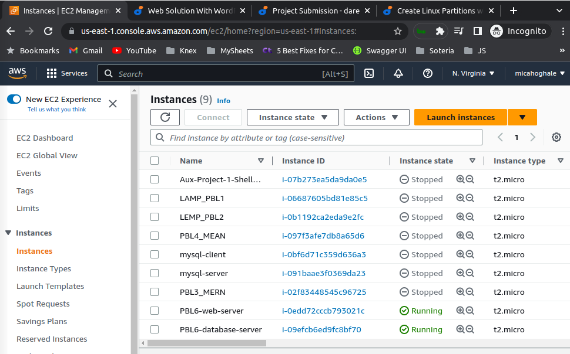
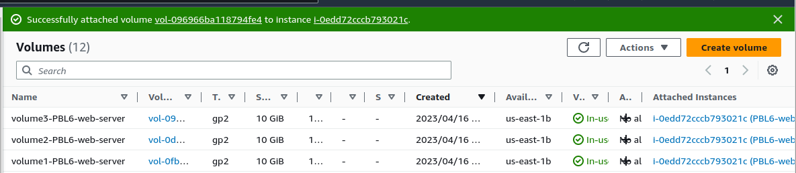
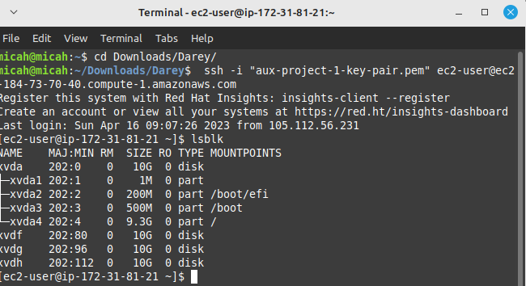

Create 2 instances(ie web server and db server) using Redhat

Web and DB volumes created and attached

List block devices attached to the web server with `lsblk`

NOTE:
Things to do:
1. Create a partition on the 3 physical disks
2. Switch into logical volume management
    i. with logical volume management tool, we are going to create physical volume,  create a volume group and then create a logical volume

This means that before you can create a logical volume,  you have to create a volume group. And before you can create a volume group, you have to have a physical volume