## LAUNCH AN EC2 INSTANCE THAT WILL SERVE AS “WEB SERVER”.

Step 1 — Prepare a Web Server
1. Launch an EC2 instance that will serve as "Web Server". Create 3 volumes in the same AZ as your Web Server EC2, each of 10 GiB.
Learn How to Add EBS Volume to an EC2 instance [here](https://www.youtube.com/watch?v=HPXnXkBzIHw)
    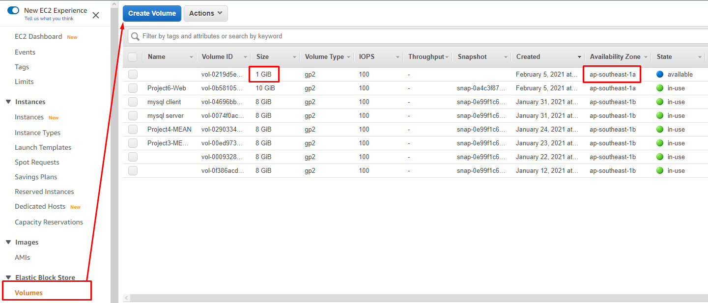


2. Attach all three volumes one by one to your Web Server EC2 instance

    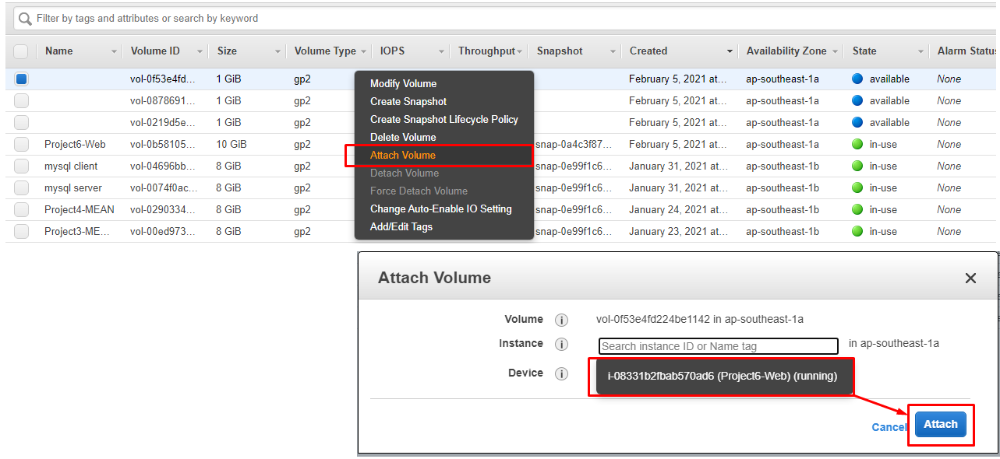

3. Open up the Linux terminal to begin configuration

4. Use [lsblk](https://man7.org/linux/man-pages/man8/lsblk.8.html) command to inspect what block devices are attached to the server. Notice names of your newly created devices. All devices in Linux reside in /dev/ directory. Inspect it with `ls /dev/` and make sure you see all 3 newly created block devices there – their names will likely be `xvdf`, `xvdh`, `xvdg`.

    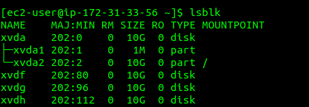

5. Use [df -h](https://en.wikipedia.org/wiki/Df_(Unix)) command to see all mounts and free space on your server. 

6. Use `gdisk` utility to create a single partition on each of the 3 disks. To know where path where the volumes `xvdf`, `xvdg` and `xvdh` are created, run `sudo ls /dev` and you will find the three volumes listed there. Note that the `dev` means `device`

```
    sudo gdisk /dev/xvdf
```

```
[ec2-user@ip-172-31-81-21 ~]$ sudo gdisk /dev/xvdf
GPT fdisk (gdisk) version 1.0.7

Partition table scan:
  MBR: not present
  BSD: not present
  APM: not present
  GPT: not present

Creating new GPT entries in memory.

Command (? for help): n
Partition number (1-128, default 1): 1       // We entered 1 because we want to use the whole disk
First sector (34-20971486, default = 2048) or {+-}size{KMGTP}:  //Press ENter
Last sector (2048-20971486, default = 20971486) or {+-}size{KMGTP}: // Press Enter
Current type is 8300 (Linux filesystem)
Hex code or GUID (L to show codes, Enter = 8300): 8e00  // Enter L to list codes. And here we enter 8e00
Changed type of partition to 'Linux LVM'

Command (? for help): p // Use the command P to check what has been done, which shows things are right as seen below
Disk /dev/xvdf: 20971520 sectors, 10.0 GiB
Sector size (logical/physical): 512/512 bytes
Disk identifier (GUID): 78B9C180-21BD-4709-A2D2-424D18B6259F
Partition table holds up to 128 entries
Main partition table begins at sector 2 and ends at sector 33
First usable sector is 34, last usable sector is 20971486
Partitions will be aligned on 2048-sector boundaries
Total free space is 2014 sectors (1007.0 KiB)

Number  Start (sector)    End (sector)  Size       Code  Name
   1            2048        20971486   10.0 GiB    8E00  Linux LVM

Command (? for help): 

Command (? for help): w // Enter w to write and continue with a yes as prompted

Final checks complete. About to write GPT data. THIS WILL OVERWRITE EXISTING
PARTITIONS!!

Do you want to proceed? (Y/N): y  //Enter y for yes
OK; writing new GUID partition table (GPT) to /dev/xvdf.
The operation has completed successfully.

```
**Note:** Now,  your changes has been configured succesfuly, exit out of the `gdisk` console `and do the same for the remaining disks`.

7. Use `lsblk` utility to view the newly configured partition on each of the 3 disks.

    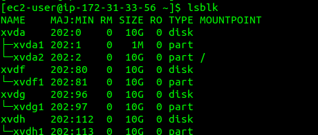

8. Install [lvm2](https://en.wikipedia.org/wiki/Logical_Volume_Manager_(Linux)) package using `sudo yum install lvm2 -y`. 
    - Confirm that lvm is properly installed and on your system by running the command `which lvm`

    - Run `sudo lvmdiskscan -y` command to check for available partitions.

**Note:** Previously, in Ubuntu we used `apt` command to install packages, in RedHat/CentOS a different package manager is used, so we shall use `yum` command instead.

**Mark each of of the 3 disks as physical volumes(PVs)**
9. Use [pvcreate](https://linux.die.net/man/8/pvcreate) utility to mark each of 3 disks as physical volumes (PVs) to be used by LVM. **Note:** you cannot create physical volumes directly on your physical device. You have to create them on a partition

```
sudo pvcreate /dev/xvdf1
sudo pvcreate /dev/xvdg1
sudo pvcreate /dev/xvdh1
```

10. Verify that your Physical volume has been created successfully by running `sudo pvs`

    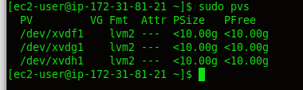

11. Use [vgcreate](https://linux.die.net/man/8/vgcreate) utility to add all 3 PVs to a volume group (VG). Name the VG **webdata-vg**. You can use `vgextend` to also dynamically extend the Logical volume group, which increases the capacity of the volume group by adding physical volumes when the need arises
```
sudo vgcreate webdata-vg /dev/xvdh1 /dev/xvdg1 /dev/xvdf1
```

**Note:** the above command is used to group the 3 physical volumes together into a volume group(VG) which we named as **webdata-vg**
##
12. Verify that your VG has been created successfully by running `sudo vgs`. And also see how the physical volumes has been grouped together running `sudo pvs` again and added the capacities of each of the physical volumes together as shown in the first image below. Also note that due to the grouping/concatenation of the 3 disks, they are now `1 logical` disk

    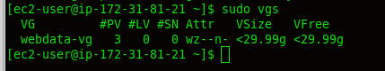

    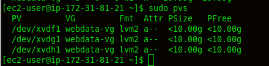

13. Use [lvcreate](https://linux.die.net/man/8/lvcreate) utility to create 2 logical volumes. **apps-lv (Use half of the PV size)**, and **logs-lv Use the remaining space of the PV size.**

**NOTE:** `apps-lv` will be used to `store data for the Website` while, `logs-lv` will be used to `store data for logs`.


```
sudo lvcreate -n apps-lv -L 14G webdata-vg
sudo lvcreate -n logs-lv -L 14G webdata-vg
```
**NOTE:** that the logical volume is what we give to our servers. You dont give physical volumes to servers, rather it is logical volumes

14. Verify that your Logical Volume has been created successfully by running `sudo lvs`

    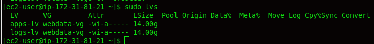

**Scenerio:** assuming the apps or logs logical volumes is filled up. We can extend them if volume group still has space. But in a case where the volume group also, do not have more space, we can add more physical volume(s). Use the `gdisk` utility to create single partitions on the disk, Mark the physical volume using `pvcreate`, use the `vgextend` command to dynamically extend the LVM volume group, use the `lvextend` to extend the size of say each of the logical volume(s). So we can increase/decrease the size of our disk without switching of the server, which is the essence of logical disk management

15. Verify the entire setup

```
sudo vgdisplay -v #view complete setup - VG, PV, and LV
sudo lsblk 
```
   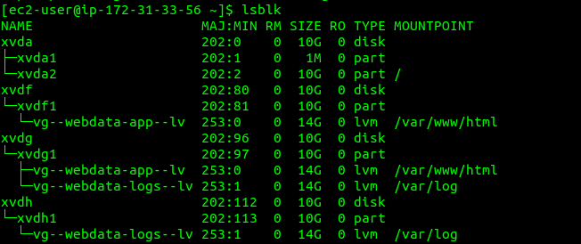
   
   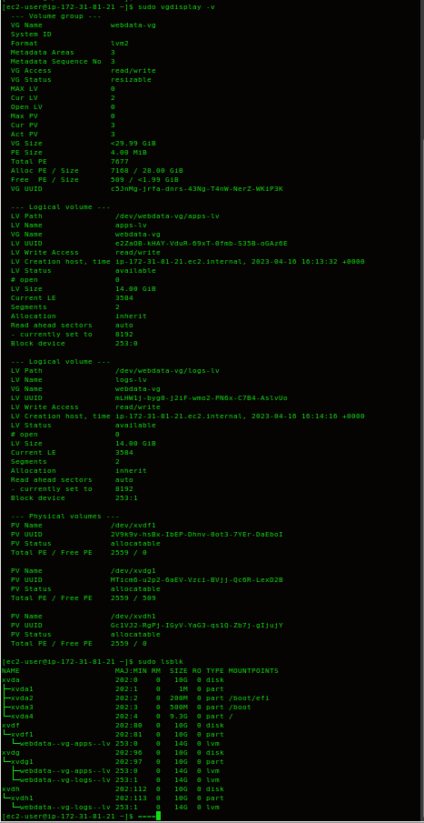

16. Use `mkfs.ext4` to format the logical volumes with [ext4](https://en.wikipedia.org/wiki/Ext4) filesystem
```
sudo mkfs -t ext4 /dev/webdata-vg/apps-lv
sudo mkfs -t ext4 /dev/webdata-vg/logs-lv

```
   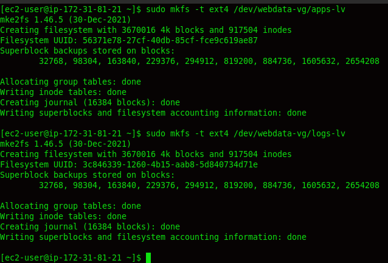


#### Create a Mount Point for our devices

Before creating the files/directories, first check if the paths or directories or files already exist as it is a good practice

17. Create **/var/www/html** directory to store website files
```
sudo mkdir -p /var/www/html   // -p here means create the directories/files if the do not exist
```

18. Create /home/recovery/logs to store backup of log data
```
sudo mkdir -p /home/recovery/logs
```

19. Mount **/var/www/html** on **apps-lv** logical volume
```
sudo mount /dev/webdata-vg/apps-lv /var/www/html/  // This would make the contents of "/var/www/html" accessible within the "apps-lv" logical volume, allowing files in that directory to be stored and retrieved from the logical volume.

Also before mounting, it is best to first check if there are files on the /var/www/html. This is because mounting automatically erase the content of that /var/www/html
```

20. Use [rsync](https://linux.die.net/man/1/rsync) utility to `backup` all the files in the log directory **/var/log** into **/home/recovery/logs** (This is required before mounting the file system)

First, lets check if there are data in `/var/log` by running `sudo ls -l /var/log`. As can be seen, there is data and not empty. If we mount /var/log without having a backup, then we will loose the data 
```
sudo rsync -av /var/log/ /home/recovery/logs/   // Remember we created the /home/recovery/logs before now

```

21. Mount **/var/log** on **logs-lv** logical volume. (Note that all the existing data on /var/log will be deleted. That is why step 15 above is very important)

```
sudo mount /dev/webdata-vg/logs-lv /var/log

```
Confirm  if the logical volumes has been mounted by running `df -h`

   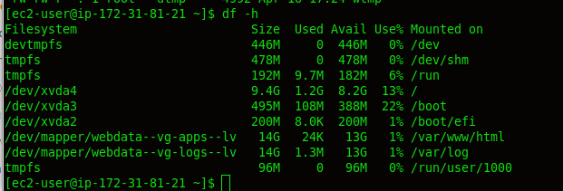


22. Restore log files back into **/var/log** directory

```
sudo rsync -av /home/recovery/logs/ /var/log

```

23. Update `/etc/fstab` file so that the mount configuration will persist after restart of the server. 

**Click on the next button** To update the `/etc/fstab` file.

Goto `README2.md` file for continuation