## UPDATE THE `/ETC/FSTAB` FILE
The UUID of the device will be used to update the `/etc/fstab` file;

`sudo blkid`

    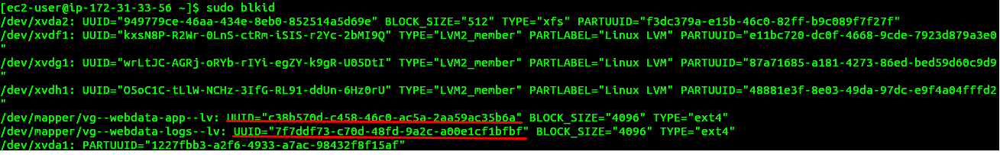

Copy the UUID for the mapped volumes i.e `/dev/mapper/webdata--vg-logs--lv` and `/dev/mapper/webdata--vg-apps--lv`. Note: this will vary depending on your logical volumes and mount points

Also, clean it up into this 

   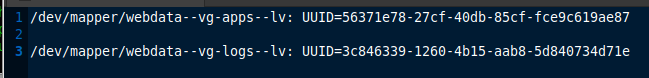


Open this file and update `sudo vi /etc/fstab`

Update` /etc/fstab `in this format using your own UUID and rememeber to remove the leading and ending quotes. 
    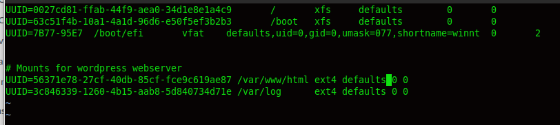


1. Test the configuration and reload the daemon
    ```
    sudo mount -a  // If this command returns no output, it means your configuration is ok
    sudo systemctl daemon-reload

    ```

2. Verify your setup by running `df -h`, output must look like this:

    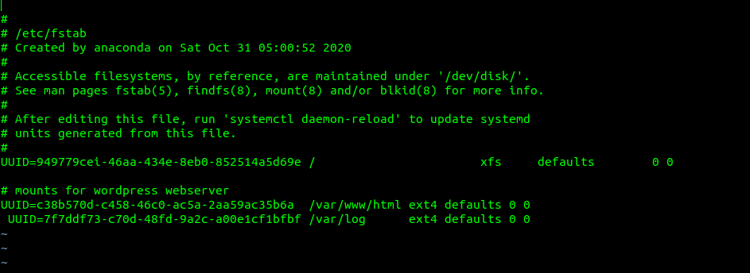


### Step 2 — Prepare the Database Server

Launch a second RedHat EC2 instance that will have a role – ‘DB Server’

Repeat the same steps as for the Web Server, but instead of `apps-lv` create `db-lv` and mount it to `/db` directory instead of `/var/www/html/`.

Note: create just 1 logical volume with `sudo lvcreate -n db-lv -L 20G dbdata-vg`. If you made a mistake in allocating the right size, you can use the command to extend the logical volume size:

First check the path and size using the command `sudo lvdisplay` OR `sudo vgdisplay` as the case maybe

Then run `sudo sudo lvextend /dev/dbdata-vg/db-lv -L 20G`

After creating the logical volumes, then its time to:

   a. format the logical volumes with `ext4` filesystem by running `sudo mkfs -t ext4 /dev/dbdata-vg/db-lv`

   b. After formatting the logical volumes, then its time to mount. As the instruction stated above, we need to first create a directory called `/db`. Check that it is empty(ie `sudo ls -l /db`) and so we do not need to backup anything

   c. run `sudo mount /dev/dbdata-vg/db-lv /db` to mount it on `/db`
   d. run `df -h` see that it is mounted
      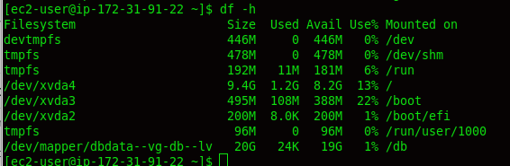
   e. we need to make it persistence by first running:
       i. `sudo blkid`
       ii. copy out the `/dev/mapper/dbdata--vg-db--lv: UUID="5e2416b3-21f2-4a2a-bd83-fc7129969781" BLOCK_SIZE="4096" TYPE="ext4` and remove the unwanted character. 
       iii. edit this file by running `sudo vi /etc/fstab` and update as the case maybe
        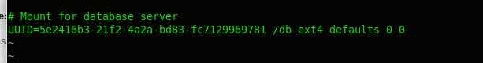
       iv. run `sudo mount -a` to ensure that the configuration has no error
       v. restart the deamon by running `sudo systemctl daemon-reload`
       vi. run `df -h` to see all that we have done
        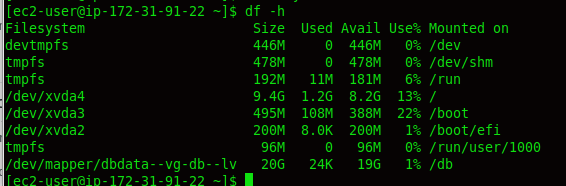

Then continue with **Step 3 — Install WordPress on your Web Server EC2** below

### Step 3 — Install WordPress on your Web Server EC2

1. Update the repository

    `sudo yum -y update`

2. Install wget, Apache and it’s dependencies

    ```sudo yum -y install wget httpd php php-mysqlnd php-fpm php-json```

3. Start Apache
    ```
    sudo systemctl enable httpd
    sudo systemctl start httpd
    ```
    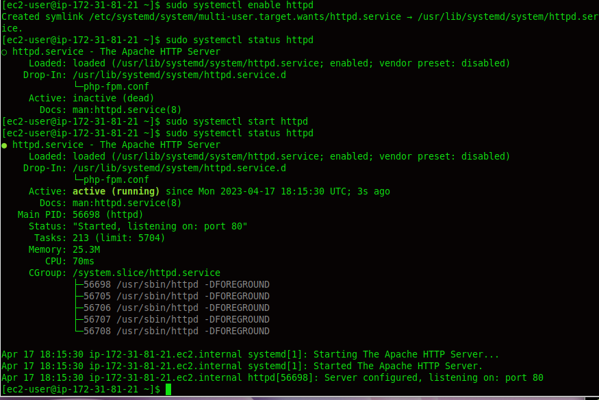

4. To install PHP and it’s depemdencies
    ```
    <!-- sudo yum install https://dl.fedoraproject.org/pub/epel/epel-release-latest-8.noarch.rpm

    <!-- sudo yum install yum-utils http://rpms.remirepo.net/enterprise/remi-release-8.rpm -->

       sudo dnf install dnf-utils http://rpms.remirepo.net/enterprise/remi-release-8.rpm -v

    sudo yum module list php
    sudo yum module reset php
    sudo yum module enable php:remi-7.4
    sudo yum install php php-opcache php-gd php-curl php-mysqlnd -->

    sudo yum update 
    sudo dnf install -y https://dl.fedoraproject.org/pub/epel/epel-release-latest-9.noarch.rpm   // Use the command to configure the EPEL repository on your system

    sudo dnf install -y https://rpms.remirepo.net/enterprise/remi-release-9.rpm     // configure the REMI repository by running the below command

    sudo dnf module list php   //  list all the available PHP module streams with the following command
    
    sudo dnf module enable php:remi-8.2   //  For example, I need to install PHP 8.2, then choose php:remi-8.2 from the screenshot that appears after running the previous command. You can select another version as per your requirements

    sudo dnf install php php-cli php-common
    
    php -v   // verify the installed PHP version

    sudo dnf install php-opcache php-gd php-curl php-mysqlnd    // Install required PHP Modules

    sudo systemctl start php-fpm
    sudo systemctl status php-fpm
    sudo systemctl enable php-fpm

    sudo setsebool -P httpd_execmem 1   // To instruct SELinux to allow Apache to execute the PHP via PHP-FPM run
    
    ```
5. Restart Apache

    `sudo systemctl restart httpd`

6. Download wordpress and copy wordpress to `var/www/html`
```
    mkdir wordpress
    cd   wordpress
    sudo wget http://wordpress.org/latest.tar.gz
    sudo tar xzvf latest.tar.gz
    sudo rm -rf latest.tar.gz
    cd wordpress
    sudo cp -R wp-config-sample.php wp-config.php   //  creates wp-config first and copy over the content of wp-config-sample
    <!-- sudo cp wordpress/wp-config-sample.php wordpress/wp-config.php -->
    cp -R wordpress/. /var/www/html/
    cd /var/www/html
    ls
```

7. Configure SELinux Policies
```
  sudo chown -R apache:apache /var/www/html/
  sudo chcon -t httpd_sys_rw_content_t /var/www/html/ -R
  sudo setsebool -P httpd_can_network_connect=1

  <!-- sudo chown -R apache:apache /var/www/html/wordpress
  sudo chcon -t httpd_sys_rw_content_t /var/www/html/wordpress -R
  sudo setsebool -P httpd_can_network_connect=1 -->
```

### Step 4 — Install MySQL on your DB Server EC2
```
sudo yum update
sudo yum install mysql-server
```

Verify that the service is up and running by using `sudo systemctl status mysqld`, if it is not running, restart the service and enable it so it will be running even after reboot:
```
sudo systemctl start mysqld
sudo systemctl enable mysqld
```

```
sudo mysql_secure_installation  // entered n and entered P@ssw0rd as the password
```
   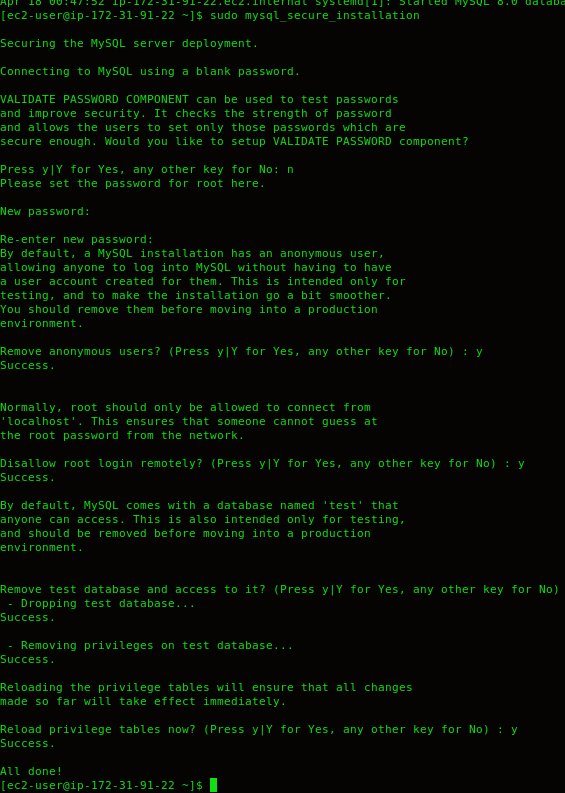

### Step 5 — Configure DB to work with WordPress

Login to mysql

```
sudo mysql -u root -p

CREATE DATABASE wordpress;

show databases;  // To see the `wordpress` database created

<!-- CREATE USER `wordpress`@`<Web-Server-Private-IP-Address>` IDENTIFIED BY 'P@ssw0rd'; // You can use this to make the database more secure. also if more web servers that will talk to the db, you can just use the ip range and cidr eg 176.9.99.0/16 -->

CREATE USER 'wordpress'@'%' IDENTIFIED WITH mysql_native_password BY 'P@ssw0rd';

<!-- GRANT ALL PRIVILEGES ON wordpress.* TO 'wordpress'@'<Web-Server-Private-IP-Address>'; -->

GRANT ALL PRIVILEGES ON *.* TO 'wordpress'@'%' WITH GRANT OPTION;

FLUSH PRIVILEGES;
SHOW DATABASES;

select user, host from mysql.user;  // Check if the user has been created 
exit

```

Set the Bind Address
    - `sudo vi /etc/my.cnf` by adding the below

```
    [mysqld]
    bind-address=0.0.0.0   # Remember that % was used when creating the user which means that you can connect from anywhere. If a particular IP address or cidr was used, then the 0.0.0.0 should not be used, rather the said ip address and or with its cidr notation if more than one cidr webserver will be connecting to the database

```
   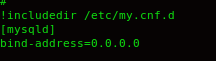

   - Restart **mysqld** by running `sudo systemctl restart mysqld`

### Step 6 — Configure WordPress to connect to remote database.
- On the webserver run `sudo vi wp-config.php` and update all the necessary fields to connect to the db server as shown in the image below.

**Note:**
- On the `define( 'DB_HOST', '172.31.91.22' );`, If you leave it localhost, it means the database also resides on thesame machine as the webserver. But if the database resides in another instance, then we have to change the localhost. Use the Private Ip address of the db if they are on the same subnet or vpc ELSE use the public address

   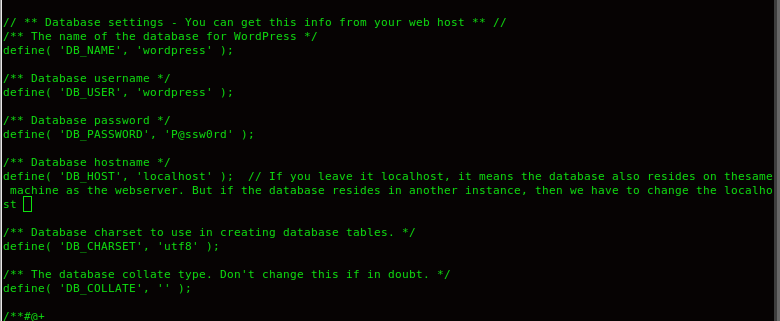

- Restart the httpd by running `sudo systemctl restart httpd`

- Remove / renaming the default apache welcome page by running `sudo mv /etc/httpd/conf.d/welcome.conf /etc/httpd/conf.d/welcome.conf_backup`
**Hint:** Do not forget to open MySQL port 3306 on DB Server EC2. For extra security, you shall allow access to the DB server ONLY from your Web Server’s IP address, so in the Inbound Rule configuration specify source as /32 **BUT** if you open all ports at will(which is not advisable), then no need to do the below


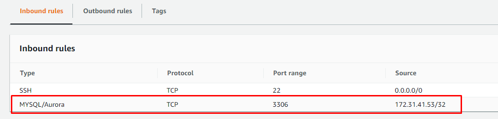

1. Install MySQL client and test that you can connect from your Web Server to your DB server by using mysql-client
```
sudo yum install mysql
sudo mysql -u admin -p -h <DB-Server-Private-IP-address> // eg sudo mysql -h 172.31.91.22 -u wordpress -p
```
   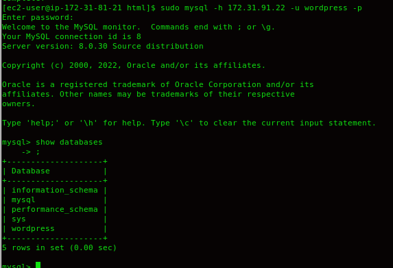
###
2. Verify if you can successfully execute `SHOW DATABASES;` command and see a list of existing databases.

3. Change permissions and configuration so Apache could use WordPress:

4. Enable TCP port 80 in Inbound Rules configuration for your Web Server EC2 (enable from everywhere 0.0.0.0/0 or from your workstation’s IP)

5. Try to access from your browser the link to your WordPress `http://<Web-Server-Public-IP-Address>/wordpress/` OR `http://<Web-Server-Public-IP-Address>/`

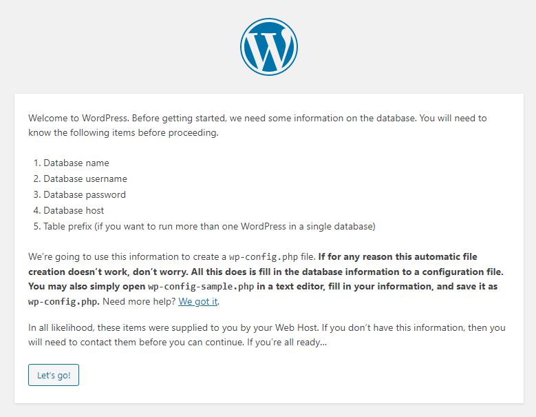

Fill out your DB credentials:

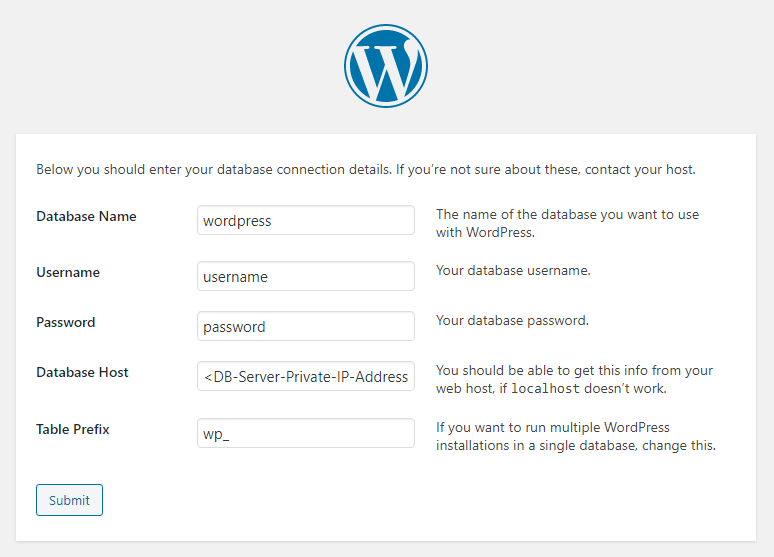


If you see this message – it means your WordPress has successfully connected to your remote MySQL database

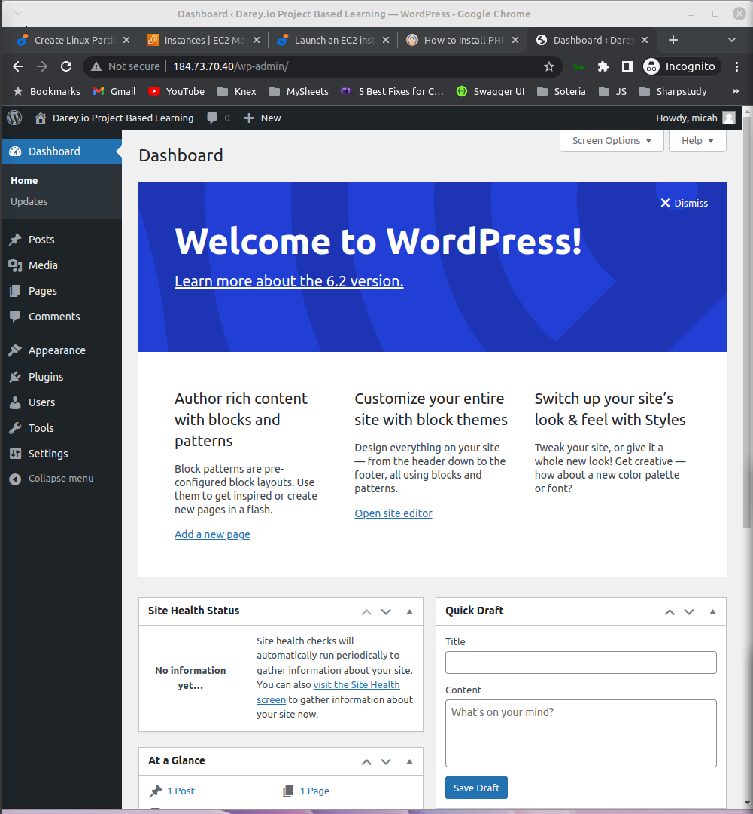

**Important:** Do not forget to **STOP** your EC2 instances after completion of the project to avoid extra costs.

###
## CONGRATULATIONS!
You have learned how to configure Linux storage susbystem and have also deployed a full-scale Web Solution using WordPress CMS and MySQL RDBMS!


